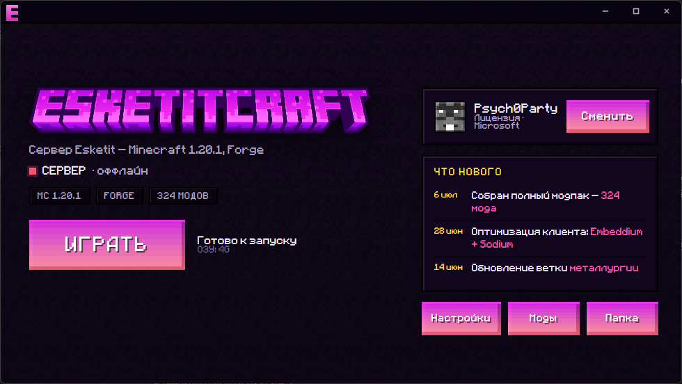

<p align="center"></p>

<h3 align="center">Официальный лаунчер сервера ESKETITCRAFT</h3>

<p align="center">Заходи на сервер без возни с установкой Java, Forge и модов — лаунчер сделает всё сам.</p>

<p align="center">
<a href="https://github.com/stuffy-man/EsketitLauncher/releases/latest"></a>
<a href="https://github.com/stuffy-man/EsketitLauncher/releases"></a>
</p>



## ⬇️ Скачать

**[Скачать последнюю версию](https://github.com/stuffy-man/EsketitLauncher/releases/latest)** → запусти файл `Esketit-Launcher-setup-*.exe`.

Установи, войди (Microsoft или офлайн) и жми **ИГРАТЬ** — лаунчер сам скачает сборку и запустит игру. Обновляется тоже сам.

| Платформа | Файл |
| --- | --- |
| Windows x64 | `Esketit-Launcher-setup-VERSION.exe` |

> При установке Windows может показать «Неизвестный издатель» (приложение без платной подписи) — жми «Подробнее → Выполнить в любом случае».

## ✨ Возможности

* 🎮 **Вход двумя способами** — лицензия Microsoft или офлайн (по нику).
* 📦 **Автосборка** — 324 мода (Minecraft 1.20.1 / Forge 47.4.0) скачиваются и проверяются автоматически.
* ☕ **Java не нужна заранее** — лаунчер сам поставит подходящую версию.
* 🧩 **Экран модов** — включай/выключай клиентские моды (оптимизация, интерфейс, шейдеры).
* ⚙️ **Настройки** — память, аргументы JVM, разрешение окна и другое.
* 📰 **Новости** прямо в лаунчере.
* 🔄 **Автообновление** — новые версии ставятся сами.

## 🧱 О сервере

* **Версия:** Minecraft **1.20.1**, Forge **47.4.0**
* **Модпак:** 324 мода (247 серверных + 77 клиентских, переключаемых)

## 🛠️ Для владельца

* **Дистрибутив сборки** раздаётся через GitHub Pages: `https://stuffy-man.github.io/esketit-dist/`
* **Новости:** файл `news.json` в репозитории [`esketit-dist`](https://github.com/stuffy-man/esketit-dist) — правишь → `git push` → появляются в лаунчере (пересборка не нужна).
* **Новая версия лаунчера:** поднять `version` в `package.json` → `npm run dist:win -- --publish always` → опубликовать релиз на GitHub.
* **Серверные моды:** папка `server-mods/` (кладутся на Forge-сервер, `online-mode=false`).

## 👩‍💻 Разработка

```console
git clone https://github.com/stuffy-man/EsketitLauncher.git
cd EsketitLauncher
npm install
npm start
```

Сборка установщика:

```console
npm run dist:win
```

Консоль отладки в лаунчере — `Ctrl + Shift + I`. Не вставляй в неё код из непроверенных источников.

---

Лаунчер построен на [HeliosLauncher](https://github.com/dscalzi/HeliosLauncher) (© Daniel Scalzi), дистрибутив собирается через [Nebula](https://github.com/dscalzi/Nebula). Не связано с Mojang / Microsoft.

<p align="center">Увидимся в игре! 🎮</p>
